# Edgeucate. Техническая документация архитектуры системы

> Образовательная онлайн-платформа для поиска репетиторов и организации занятий с поддержкой видеоконференцсвязи, обмена сообщениями в реальном времени и системы отзывов.

## 1. Обзор архитектуры системы

Диаграмма ниже отражает структурное разделение системы на пять функциональных слоёв: клиентский (Browser), прикладной (API), слой данных (Data), пограничный (Edge) и операционный (Ops).

```mermaid
%%{init: {
  'theme': 'base',
  'themeVariables': {
    'primaryColor': '#dbeafe',
    'primaryTextColor': '#0f172a',
    'primaryBorderColor': '#334155',
    'lineColor': '#64748b',
    'secondaryColor': '#fef3c7',
    'tertiaryColor': '#f8fafc',
    'edgeLabelBackground': '#ffffff',
    'clusterBkg': '#ffffff',
    'clusterBorder': '#cbd5e1',
    'titleColor': '#0f172a',
    'fontSize': '13px'
  },
  'themeCSS': 'div.mermaid { background-color: #ffffff !important; } svg { background-color: #ffffff !important; } #main_canvas > rect.cluster-bg { fill: #ffffff !important; stroke: none !important; } .cluster-bg { fill: #ffffff !important; opacity: 1 !important; } g.node rect, g.node polygon, g.node circle { opacity: 1 !important; }',
  'flowchart': {
    'nodeSpacing': 18,
    'rankSpacing': 28,
    'curve': 'basis',
    'htmlLabels': true
  }
}}%%

flowchart LR
  subgraph main_canvas[" "]
    %% Точечная обертка, создающая изолированный белый слой %%

    subgraph group_browser["Browser"]
      node_react["React SPA<br/>[main.tsx]"]
      node_router["Router<br/>[router.tsx]"]
      node_state["Redux<br/>[store.ts]"]
      node_rest["Axios<br/>[axios.api.ts]"]
      node_websocket["Socket.IO / WebRTC"]
    end

    subgraph group_api["API"]
      node_apiapp["NestJS API<br/>[main.ts]"]
      node_security["Guards<br/>[jwt-auth.guard.ts]"]
      node_auth["Auth service<br/>[auth.service.ts]"]
      node_users["Users<br/>[user.gateway.ts]"]
      node_marketplace["Advertisements"]
      node_engagement["Messages<br/>[message.service.ts]"]
      node_notifications["Notifications<br/>gateway"]
    end

    subgraph group_data["Data"]
      node_mongo[("MongoDB Atlas<br/>(external)")]
      node_redis[("Redis<br/>cache + queue")]
      node_emailqueue["Email worker<br/>BullMQ"]
      node_smtp["SMTP"]
      node_minio[("MinIO<br/>avatars + backups")]
      node_backup["Backup<br/>cron"]
    end

    subgraph group_edge["Edge"]
      node_cloudflare{{"Cloudflare<br/>CDN + WAF"}}
      node_nginx{{"Nginx<br/>TLS proxy"}}
      node_certs["Let's Encrypt"]
      node_turn["TURN creds<br/>[turn.service.ts]"]
      node_coturn["Coturn<br/>TURN relay"]
    end

    subgraph group_ops["Ops"]
      node_compose["Docker Compose"]
      node_cicd["GitHub Actions"]
      node_promtail["Promtail"]
      node_monitoring["Prometheus + Loki"]
      node_grafana["Grafana"]
    end

    node_react --> node_router
    node_router --> node_state
    node_react --> node_rest
    node_react --> node_websocket

    node_cloudflare -->|"HTTPS"| node_nginx
    node_nginx -->|"static files"| node_react
    node_nginx -->|"/api/*"| node_apiapp

    node_rest --> node_nginx
    node_websocket --> node_nginx

    node_apiapp --> node_security
    node_security --> node_auth

    node_apiapp --> node_users
    node_apiapp --> node_marketplace
    node_apiapp --> node_engagement
    node_apiapp --> node_notifications

    node_websocket --> node_users
    node_websocket --> node_notifications

    node_websocket -->|"TURN creds"| node_turn
    node_turn --> node_coturn
    node_websocket -->|"media relay"| node_coturn

    node_auth --> node_mongo
    node_users --> node_mongo
    node_marketplace --> node_mongo
    node_engagement --> node_mongo
    node_notifications --> node_mongo

    node_apiapp --> node_redis
    node_emailqueue --> node_redis
    node_emailqueue --> node_smtp
    node_apiapp --> node_emailqueue

    node_apiapp --> node_minio
    node_backup --> node_mongo
    node_backup --> node_minio

    node_certs --> node_nginx
    node_certs --> node_coturn

    node_cicd -->|"GHCR"| node_compose
    node_cicd -->|"SSH deploy"| node_compose
    node_compose --> node_nginx
    node_compose --> node_apiapp
    node_compose --> node_backup
    node_compose --> node_promtail
    node_compose --> node_monitoring
    node_compose --> node_grafana

    node_compose -->|"logs"| node_promtail
    node_promtail --> node_monitoring
    node_apiapp -->|"/api/metrics"| node_monitoring
    node_monitoring --> node_grafana
  end

classDef toneBlue fill:#dbeafe,stroke:#2563eb,stroke-width:1.5px,color:#0f172a
classDef toneAmber fill:#fef3c7,stroke:#d97706,stroke-width:1.5px,color:#0f172a
classDef toneMint fill:#dcfce7,stroke:#16a34a,stroke-width:1.5px,color:#0f172a
classDef toneRose fill:#ffe4e6,stroke:#e11d48,stroke-width:1.5px,color:#0f172a
classDef toneIndigo fill:#e0e7ff,stroke:#4f46e5,stroke-width:1.5px,color:#0f172a

class node_react,node_router,node_state,node_rest,node_websocket toneBlue
class node_apiapp,node_security,node_auth,node_users,node_marketplace,node_engagement,node_notifications toneAmber
class node_mongo,node_redis,node_emailqueue,node_smtp,node_minio,node_backup toneMint
class node_cloudflare,node_nginx,node_certs,node_turn,node_coturn toneRose
class node_compose,node_cicd,node_promtail,node_monitoring,node_grafana toneIndigo
```

**Условные обозначения:**

| Цвет | Слой системы | Описание |
|------|--------------|----------|
| Синий | Client Tier | Компоненты клиентского приложения (SPA) |
| Желтый | Application Tier | Backend-сервисы и API |
| Зелёный | Data Tier | Хранилища данных и фоновые процессы |
| Розовый | Edge Tier | Пограничные сервисы и медиатрансляция |
| Сиреневый | Operations Tier | Развёртывание и наблюдаемость |

---

## 2. Спецификация компонентов

### 2.1. Client Tier (Browser Application)

| Компонент | Исходный файл | Назначение |
|-----------|---------------|-----------|
| React SPA | client/src/main.tsx | Точка входа клиентского приложения, инициализация Redux, роутера и системы тем |
| Router | client/src/router/router.tsx | Маршрутизация React Router с отложенной загрузкой страниц через React.lazy() |
| Redux Store | client/src/store/store.ts | Глобальное состояние приложения (user, chats, advertisements, notifications) |
| Axios API Client | client/src/api/axios.api.ts | HTTP-клиент с автоматическим обновлением JWT и защитой от CSRF |
| WebSocket Client | client/src/services/notificationsWebSocket.ts | Socket.IO клиент и интеграция WebRTC для видеоконференций |

**Ключевые паттерны реализации:**

- Отложенная загрузка: все страницы загружаются по требованию для минимизации размера начального bundle.
- Защищённые маршруты: компонент ProtectedRoute проверяет состояние аутентификации и ролевой доступ.
- Автоматическое обновление токенов: перехватчик Axios обновляет JWT через /auth/refresh при получении HTTP 401.
- Защита от CSRF: получение CSRF-токена перед выполнением первого POST-запроса.
- Система тем: автоматическое определение предпочтений через prefers-color-scheme с сохранением выбора в localStorage.

### 2.2. Application Tier (API & Realtime)

| Компонент | Исходный файл | Назначение |
|-----------|---------------|-----------|
| NestJS API | server/src/main.ts | Модульный монолит, реализованный по принципам Domain-Driven Design |
| Security Guards | server/src/guards/jwt-auth.guard.ts | JWT-аутентификация, RBAC, защита от CSRF и ограничение частоты запросов |
| Auth Service | server/src/auth/auth.service.ts | Регистрация, аутентификация, верификация email, восстановление пароля |
| Users Gateway | server/src/user/user.gateway.ts | Управление профилями, presence-статусами, ролевые запросы |
| Advertisement Service | server/src/advertisement/advertisement.service.ts | Объявления репетиторов, поиск, Redis-кэширование |
| Message Service | server/src/message/message.service.ts | Чаты в реальном времени, индикаторы набора текста |
| Notifications Gateway | server/src/notifications/notifications.gateway.ts | In-app и email-уведомления через BullMQ |

### 2.3. Data Tier (Storage & Jobs)

| Компонент | Назначение |
|-----------|-----------|
| MongoDB Atlas | Внешняя облачная база данных (основное хранилище) |
| Redis | Кэширование (коэффициент попаданий ~60%) и хранилище очередей BullMQ |
| Email Worker | Асинхронная отправка писем через SMTP |
| MinIO | S3-совместимое объектное хранилище (аватары и резервные копии) |
| Backup Cron | Ежедневные, еженедельные и ежемесячные резервные копии MongoDB |

### 2.4. Edge Tier (CDN & Media)

| Компонент | Назначение |
|-----------|-----------|
| Cloudflare | CDN-сеть, защита от DDoS-атак, WAF |
| Nginx | TLS-терминация, reverse proxy, SPA fallback |
| Let's Encrypt | Автоматическое продление TLS-сертификатов |
| TURN Service | Генерация временных учётных данных для Coturn |
| Coturn | TURN-сервер для трансляции WebRTC-трафика за NAT |

### 2.5. Operations Tier (Deployment & Observability)

| Компонент | Назначение |
|-----------|-----------|
| Docker Compose | Оркестрация 11 контейнеров в production |
| GitHub Actions | Сборка, сканирование (Trivy), развёртывание |
| Promtail | Агрегатор логов с фильтрацией (снижение шума на 95%) |
| Prometheus + Loki | Сбор метрик и агрегация логов |
| Grafana | Визуализация (дашборды: API, БД, кэш, система, бизнес-метрики) |

---

## 3. Архитектура безопасности

### 3.1. Аутентификация и авторизация

| Параметр | Значение |
|----------|----------|
| Access Token | JWT, срок действия 15 минут |
| Refresh Token | JWT, срок действия 7 дней |
| Хеширование паролей | bcrypt, 10 итераций (~100 мс на хеш) |
| Модель доступа | RBAC (Student / Teacher / Admin) |
| Email verification | Одноразовый UUID-токен, TTL 24 часа |
| Password reset | Одноразовый UUID-токен, TTL 1 час |

### 3.2. Валидация входных данных

- Клиентский уровень: HTML5-валидация и кастомные валидаторы.
- API-уровень: class-validator и class-transformer в DTO.
- Уровень БД: валидация через Mongoose-схемы.
- Санитизация: DOMPurify для пользовательского HTML-контента.

### 3.3. Ограничение частоты запросов

| Endpoint | Лимит |
|----------|-------|
| Глобальный | 1000 запросов/мин на IP |
| Endpoints аутентификации | 10 запросов/мин на IP |
| Загрузка файлов | 10 загрузок/мин на пользователя |
| WebSocket | 100 событий/мин на соединение |

Реализация: @nestjs/throttler с хранилищем в Redis.

### 3.4. Защитные механизмы

- HTTPS: TLS 1.3 через Let's Encrypt.
- HTTP-заголовки безопасности: Helmet (CSP, HSTS, X-Frame-Options).
- Защита от CSRF: паттерн Double-submit cookie.
- Соответствие 152-ФЗ: Политика конфиденциальности, Пользовательское соглашение, Cookie-баннер, чекбоксы согласия на обработку персональных данных.

---

## 4. Production-контейнеры (10 сервисов)

| Сервис | Образ | Лимит памяти | Назначение |
|--------|-------|--------------|-----------|
| client | ghcr.io/anatolka18/edgeucate/client | 256 МБ | Nginx + React SPA |
| server | ghcr.io/anatolka18/edgeucate/server | 1 ГБ | NestJS API |
| redis | redis:7-alpine | 256 МБ | Кэш и очереди |
| minio | quay.io/minio/minio:latest | 384 МБ | Объектное хранилище |
| mongo-backup | ghcr.io/anatolka18/edgeucate/mongo-backup | 128 МБ | Cron-бэкапов |
| coturn | coturn/coturn:4.6.2 | 128 МБ | TURN-сервер |
| prometheus | prom/prometheus:latest | 512 МБ | Сбор метрик |
| loki | grafana/loki:latest | 1536 МБ | Агрегация логов |
| promtail | grafana/promtail:latest | 256 МБ | Агент сбора логов |
| grafana | grafana/grafana:latest | 768 МБ | Визуализация |

---

## 5. CI/CD Pipeline

**Триггер:** Push в ветку dev.

### 5.1. Этап сборки (параллельная матрица)

| Сервис | Время сборки | Особенности |
|--------|--------------|-------------|
| server | ~30 секунды | GHA cache |
| client | ~30 секунд | GHA cache |
| mongo-backup | ~2 минуты | Multi-stage build, компиляция mc из исходников |

### 5.2. Этап сканирования (Trivy)

- Критерий отказа: обнаружение уязвимостей уровня CRITICAL или HIGH.
- Исключение: unfixed CVE пропускаются (ignore-unfixed: true).
- Проверяется: пакеты ОС, зависимости Node.js, уязвимости базовых образов.

### 5.3. Этап развёртывания (VPS через SSH)

    1. Расшифровка .env.prod.enc через SOPS + age.
    2. Передача секретов на VPS в /opt/edgeucate-secrets/ через SCP.
    3. Выполнение команд на сервере:
       - git reset --hard origin/dev
       - docker builder prune, docker image prune, docker volume prune
       - docker login ghcr.io
       - docker compose pull (с повторной попыткой при rate limit)
       - docker compose up -d
       - init-minio.sh (создание buckets и lifecycle-правил)

**Управление секретами:** SOPS + age (человекочитаемые diff'ы, нулевое количество секретов в репозитории).

---

## 6. Стек наблюдаемости

### 6.1. Метрики (Prometheus)

- HTTP: количество запросов, гистограмма задержек, коэффициент ошибок.
- База данных: длительность запросов MongoDB, использование пула соединений.
- Кэш: коэффициент попаданий/промахов Redis, использование памяти.
- Система: CPU, память, дисковый I/O, сеть.

### 6.2. Логи (Loki + Promtail)

- Источники: логи Docker-контейнеров и системные логи.
- Фильтрация: снижение шума на 95%.
- Хранение: 30 дней.
- Индексация: на основе labels (service, level, host).

### 6.3. Дашборды (Grafana)

1. API Overview — частота запросов, задержки, коэффициент ошибок.
2. Database — производительность MongoDB.
3. Cache — коэффициент попаданий Redis, использование памяти.
4. System — CPU, память, диск.
5. Business — активные пользователи, сообщения/день, бронирования.

---

## 7. Технологический стек

| Слой | Технологии |
|------|-----------|
| Frontend | React 18, TypeScript, Redux Toolkit, React Router, Tailwind CSS, Socket.IO-client |
| Backend | NestJS, TypeScript, Mongoose, BullMQ, Socket.IO, WebRTC |
| Базы данных | MongoDB Atlas, Redis |
| Хранилище | MinIO (S3-совместимый) |
| Инфраструктура | Docker, Docker Compose, Nginx, Cloudflare |
| Наблюдаемость | Prometheus, Loki, Promtail, Grafana |
| CI/CD | GitHub Actions, GHCR, SOPS |
| Безопасность | JWT, bcrypt, Helmet, Let's Encrypt, Cloudflare WAF |